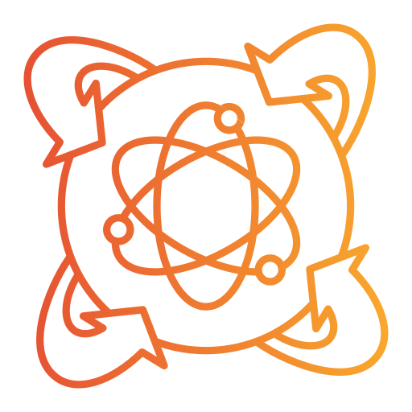

<p align="center">
  
</p>

<h1 align="center">Nexus Engine</h1>

<p align="center">
  <b>Open-source Go runtime for AI agents</b><br>
  <i>One runtime. Any LLM. Any language. Any deployment.</i>
</p>

<p align="center">
  
  
  
  
  
</p>

---

## Terminal UI

`nexus chat` drops you into a full-featured terminal interface built for long-running agent sessions.

<table>
  <tr>
    <td align="center" width="50%">
      
      <br><sub><b>Welcome screen</b> — braille logo, quick-start shortcuts</sub>
    </td>
    <td align="center" width="50%">
      
      <br><sub><b>Commands palette</b> — <code>ctrl+p</code> or <code>/</code> to open</sub>
    </td>
  </tr>
  <tr>
    <td align="center" width="50%">
      
      <br><sub><b>Model selection</b> — grouped by provider, filterable</sub>
    </td>
    <td align="center" width="50%">
      
      <br><sub><b>Provider config</b> — API keys stored encrypted per provider</sub>
    </td>
  </tr>
  <tr>
    <td align="center" width="50%">
      
      <br><sub><b>Agent at work</b> — thinking blocks, interleaved tool calls</sub>
    </td>
    <td align="center" width="50%">
      
      <br><sub><b>Streaming results</b> — markdown rendering, tool durations</sub>
    </td>
  </tr>
</table>

> **Keyboard shortcuts:** `ctrl+p` commands · `ctrl+m` model · `ctrl+s` sessions · `ctrl+,` provider config · `ctrl+e` select mode · `ctrl+c` cancel/quit

---

## Three ways to use it

### 1. CLI — `nexus`

An AI agent in your terminal. Multi-provider, local-first, skills-aware.

```bash
go install github.com/EngineerProjects/nexus-engine/cmd/cli@latest

nexus run "refactor the auth module to use context properly"
nexus chat                             # interactive multi-turn session
nexus sessions                         # list and resume sessions
nexus config set model anthropic:claude-sonnet-4-20250514
```

Sessions are persisted locally. Skills are loaded from your project. The full tool set is available — file edits, sandboxed bash, web search, browser, MCP servers, sub-agents.

---

### 2. gRPC server

Run nexus-engine as a gRPC service and generate clients for any language.

```bash
go run ./cmd/grpc   # starts on :50051
```

The contract lives in `pkg/grpc/proto/nexus.proto`. Generate a client for Python, TypeScript, Java, Rust, or any gRPC-supported language:

```bash
# Python
python -m grpc_tools.protoc -I pkg/grpc/proto --python_out=. --grpc_python_out=. nexus.proto

# TypeScript
npx grpc-tools --js_out=. --grpc_out=. pkg/grpc/proto/nexus.proto
```

One runtime. Every language.

---

### 3. Go SDK

Embed the full runtime in your own Go application.

```go
import "github.com/EngineerProjects/nexus-engine/pkg/sdk"

client, err := sdk.NewClient(&sdk.ClientConfig{
    APIKey: os.Getenv("ANTHROPIC_API_KEY"),
    Model:  sdk.ModelIdentifier{Provider: "anthropic", Model: "claude-sonnet-4-20250514"},
})
if err != nil {
    log.Fatal(err)
}
defer client.Close()

session, _ := client.CreateSession(ctx)
resp, _ := session.SubmitMessage(ctx, "Write a Go HTTP handler for /health")
fmt.Println(resp.Content)
```

---

## Capabilities

| Capability | Details |
|---|---|
| **Multi-provider** | 15 providers: Anthropic, OpenAI, Gemini, Mistral, DeepSeek, Ollama, OpenRouter, AWS Bedrock, GCP Vertex, Azure Foundry, Codex, MiniMax, Z.ai, OpenCode, Cloudflare Workers AI |
| **60+ built-in tools** | File read/write/patch, bash (Landlock sandbox on Linux), web search, web fetch, browser (Playwright), grep/glob, LSP, sub-agents, RAG, tasks, memory, worktree, notebooks, image generation, TTS/STT |
| **MCP client** | Universal MCP client — plug in any MCP server (GitHub, Postgres, Slack, Docker, Notion, …) |
| **Skills** | Markdown instruction files injected into the system prompt — encode your team's conventions and domain expertise |
| **Execution modes** | `execute` (default), `plan` (review before act), `pair_programming` (collaborative) |
| **Permission engine** | Per-tool deny rules, auto-mode LLM classifier, configurable per session (`auto` / `acceptEdits` / `onRequest` / `bypass` / `never`) |
| **Session persistence** | SQLite-backed multi-turn sessions, resumable across restarts |
| **Streaming** | Text chunks + structured runtime events (tool calls, plan events, permission requests, token usage) |
| **Long-context compaction** | Automatic context compression when approaching the model's window (configurable threshold) |
| **Observability** | Prometheus metrics + OpenTelemetry tracing (OTLP gRPC export, no-op when endpoint not set) |

---

## Supported providers

| Provider ID | Service | Auth |
|---|---|---|
| `anthropic` | Anthropic | `ANTHROPIC_API_KEY` |
| `openai` | OpenAI | `OPENAI_API_KEY` |
| `gemini` | Google Gemini | `GOOGLE_API_KEY` |
| `mistral` | Mistral AI | `MISTRAL_API_KEY` |
| `deepseek` | DeepSeek | `DEEPSEEK_API_KEY` |
| `ollama` | Ollama (local) | none |
| `openrouter` | OpenRouter | `OPENROUTER_API_KEY` |
| `bedrock` | AWS Bedrock | `AWS_ACCESS_KEY_ID` + region |
| `vertex` | GCP Vertex AI | `ANTHROPIC_VERTEX_PROJECT_ID` + region |
| `foundry` | Azure AI Foundry | `ANTHROPIC_FOUNDRY_API_KEY` |
| `codex` | ChatGPT Pro (OAuth) | device-code flow |
| `minimax` | MiniMax | `MINIMAX_API_KEY` |
| `z-ai` | Z.ai | `Z_AI_API_KEY` |
| `opencode` | OpenCode Zen | `OPENCODE_API_KEY` |
| `workers-ai` | Cloudflare Workers AI | `CLOUDFLARE_API_KEY` |

Full model listings and capabilities: [`docs/providers.md`](./docs/providers.md).

---

## Quick start

```bash
git clone https://github.com/EngineerProjects/nexus-engine
cd nexus-engine

export ANTHROPIC_API_KEY=sk-ant-...

# Interactive chat
go run ./cmd/cli chat

# One-shot run in the current directory
go run ./cmd/cli run "list all TODO comments in this codebase"

# gRPC server (port 50051)
go run ./cmd/grpc
```

---

## Skills

Skills are Markdown files that encode expertise injected into the agent's system prompt at runtime.

```
.nexus/skills/
  go-conventions.md     # "always use context.Context as the first parameter..."
  git-workflow.md       # "never commit to main, always open a PR, squash before merge..."
  security-rules.md     # "never log secrets, validate all external input at boundaries..."
```

---

## MCP

Any MCP server is immediately usable — no additional development needed.

```go
client, _ := sdk.NewClient(&sdk.ClientConfig{
    MCPServers: []sdk.MCPServerConfig{
        {Name: "github",   Command: "npx", Args: []string{"-y", "@modelcontextprotocol/server-github"}},
        {Name: "postgres", Command: "npx", Args: []string{"-y", "@modelcontextprotocol/server-postgres", "postgresql://..."}},
        {Name: "slack",    Command: "npx", Args: []string{"-y", "@modelcontextprotocol/server-slack"}},
    },
})
```

---

## Architecture

<p align="center">
  
</p>

Full architecture diagrams (Mermaid): [`docs/vision/diagrams.md`](./docs/vision/diagrams.md).

---

## Building a product on top

nexus-engine is the open-source core runtime — no users, no billing, no access control.

If you need multi-user auth, organizations, workspaces, per-user provider credentials, and a REST/SSE HTTP API, those live in **nexus-product** — a private product layer built on top of this engine.

---

## Documentation

| Doc | What it covers |
|---|---|
| [Vision & Roadmap](./docs/vision/README.md) | Project idea, design principles, Level 1→2→3 roadmap |
| [Architecture](./docs/architecture.md) | System design, layer diagrams, query loop state machine |
| [SDK Guide](./docs/sdk.md) | `ClientConfig`, sessions, streaming, callbacks, MCP |
| [Tools](./docs/tools.md) | Built-in tools reference, permission pipeline |
| [Providers](./docs/providers.md) | Multi-provider routing, retry, circuit breaker |
| [Prompt System](./docs/prompt-system.md) | Section assembly, stage overlays, cache control |
| [Skills](./docs/skills.md) | Skills system, loading order, injection |
| [Transports & Setup](./docs/transports.md) | gRPC setup, proto codegen, env vars |

---

## Development

```bash
make build       # build CLI and gRPC binaries → bin/
make test        # run all tests
make test-race   # run tests with race detector
make lint        # golangci-lint
make hooks       # install git pre-commit hooks (run once after cloning)
```

See [`CONTRIBUTING.md`](./CONTRIBUTING.md) for the full contribution guide.

---

## Security

To report a vulnerability, see [`SECURITY.md`](./SECURITY.md).

---

## License

[Apache 2.0](./LICENSE)
