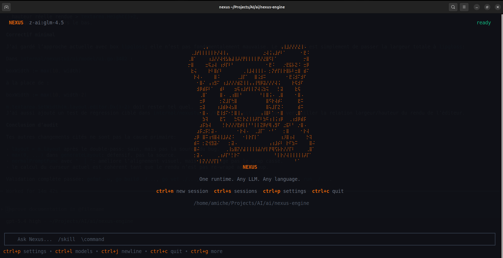
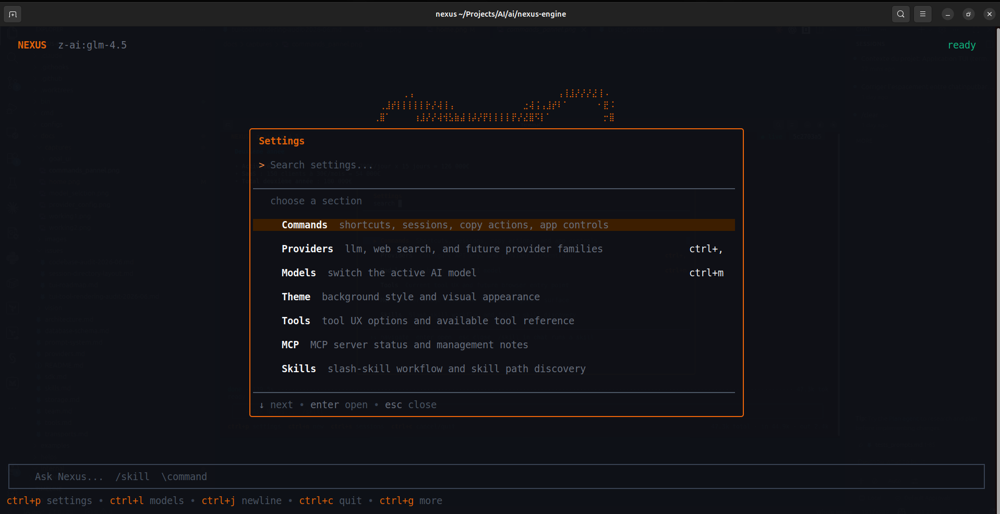
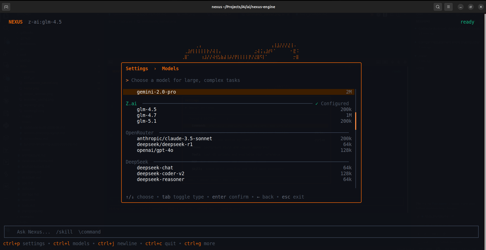
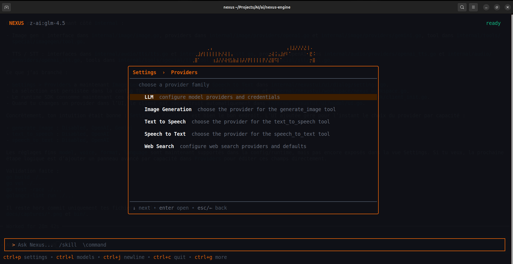
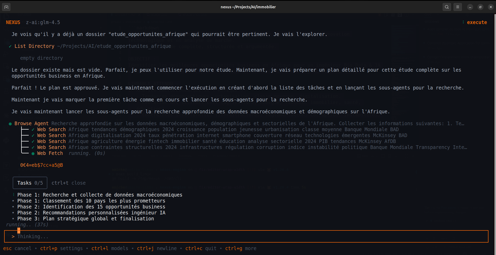
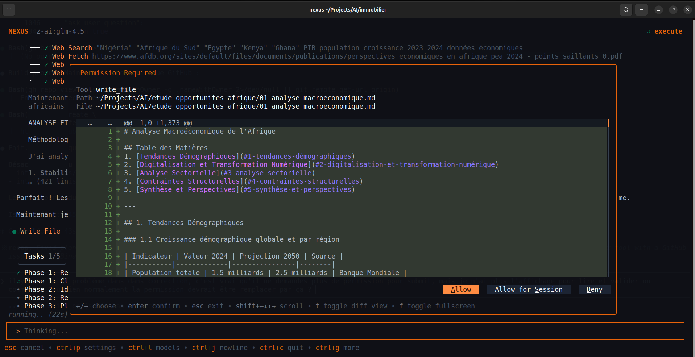
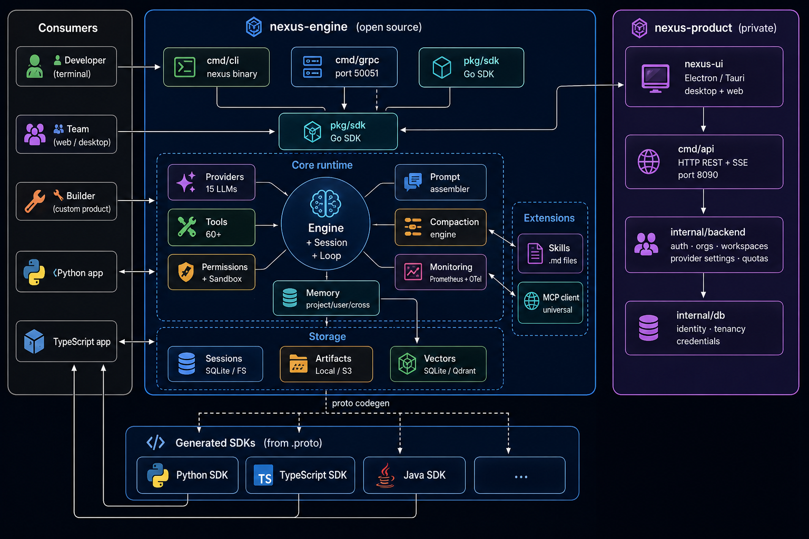

<p align="center">
  
</p>

<h1 align="center">Seshat</h1>

<p align="center">
  <b>Open-source Go agent runtime for governed, multi-provider, self-hostable execution</b><br>
  <i>Built for serious agent work today, with a larger open-source vision behind it.</i>
</p>

<p align="center">
  <a href="https://seshat-ai.com"><b>🌐 Website</b></a> ·
  <a href="https://github.com/EngineerProjects/seshat/discussions"><b>💬 Discussions</b></a> ·
  <a href="https://github.com/EngineerProjects/seshat/issues"><b>🐛 Issues</b></a> ·
  <a href="https://github.com/EngineerProjects/seshat-ai"><b>🖥️ seshat-ai</b></a>
</p>

<p align="center">
  
  
  
  
  
</p>

---

## What Seshat Is Today

Seshat is an open-source Go agent runtime for people who need more than a chat shell and less vendor lock-in than a closed assistant.

Its current wedge is concrete:

- governed multi-turn agent execution
- tools, files, sandboxed bash, web, browser, MCP, RAG, and skills
- multi-provider routing with self-hosted and local-first deployment options
- persistent sessions, permissions, recovery, and audit-friendly behavior
- CLI/TUI, gRPC, and Go SDK surfaces on the same runtime core

If you want the class of tool people reach for in products like Claude Code, but open, written in Go, multi-provider, and deployable under your own rules, this is the project.

## Why This Exists

Most of the market still splits into two weak extremes:

- chat products that answer well but do not own serious execution
- low-level frameworks that are flexible but too fragmented, too provider-shaped, or too awkward to ship as a real runtime

Seshat is the missing middle layer: an execution runtime that can actually run agents, call tools, hold sessions, enforce permissions, recover from failures, and stay usable as infrastructure.

## The Broader Open-Source Direction

The project still keeps a broader ambition, and that matters for the community.

Seshat is not only about making one strong solo agent. The longer-term direction is organized agentic work: explicit roles, mission memory, structured coordination, durable teams, and an open foundation that others can extend through skills, MCP servers, SDK integrations, and domain-specific workflows.

That larger vision belongs in the docs and in open-source discussion because contributors need the map, not only the current feature list.

- Product and runtime direction: https://seshat-ai.com/docs/learn/vision
- Runtime concepts and architecture: https://seshat-ai.com/docs/concepts/what-is-seshat
- Technical bets behind the project: https://seshat-ai.com/docs/learn/technical-hypotheses

## Runtime First, Platform Above It

`Seshat` is the runtime layer.

Use this repository if you want to:

- run agents locally or self-host them under your own control
- embed the runtime inside a Go application or internal system
- extend providers, tools, permissions, MCP integration, or runtime behavior

If you want the full self-hosted platform layer for organizations, use [seshat-ai](https://github.com/EngineerProjects/seshat-ai): users, workspaces, REST API, knowledge base, scheduling, governance, and desktop product surfaces built on top of this engine.

---

## 🖥️ Terminal UI


`seshat chat` drops you into a full-featured terminal interface built for long-running agent sessions.

<table>
  <tr>
    <td align="center" width="50%">
      
      <br><sub><b>Welcome</b> — up and running in 10 seconds</sub>
    </td>
    <td align="center" width="50%">
      
      <br><sub><b>Settings panel</b> — every shortcut, one keystroke away (<code>ctrl+p</code>)</sub>
    </td>
  </tr>
  <tr>
    <td align="center" width="50%">
      
      <br><sub><b>Model selection</b> — switch across 20+ models in 2 keystrokes</sub>
    </td>
    <td align="center" width="50%">
      
      <br><sub><b>Provider config</b> — API keys encrypted, scoped per provider</sub>
    </td>
  </tr>
  <tr>
    <td align="center" width="50%">
      
      <br><sub><b>Agent at work</b> — full reasoning trace, thinking blocks + tool calls</sub>
    </td>
    <td align="center" width="50%">
      
      <br><sub><b>Streaming results</b> — streamed responses with markdown + tool timings</sub>
    </td>
  </tr>
</table>

> **Keyboard shortcuts:** `ctrl+p` settings · `ctrl+m` models · `ctrl+s` sessions · `ctrl+,` providers · `ctrl+n` new session · `ctrl+t` tasks · `ctrl+u` copy last response · `ctrl+y` toggle yolo · `ctrl+o` open editor · `ctrl+g` help · `ctrl+c` quit

> **Clipboard note (Linux):** selection copy works best when `wl-clipboard` (Wayland) or `xclip`/`xsel` (X11) is installed. Without a system clipboard backend, Seshat can request terminal clipboard access but cannot guarantee a real system copy.

> **Compaction note:** transcript compaction is automatic today. A dedicated manual compact action is planned for the TUI once the runtime exposes a real manual-compaction hook.

---

## 🌐 The Seshat Ecosystem

seshat is the **headless runtime**: pure Go, no UI, no users, no billing. It is the foundation everything else builds on.

### 🖥️ seshat-ai — Desktop & Platform

**[→ seshat-ai](https://github.com/EngineerProjects/seshat-ai)** is the full production platform built on top of this engine. If you want a ready-to-use application rather than a library, that is where you want to go.

| | seshat (this repo) | seshat-ai |
|---|---|---|
| **What it is** | Go runtime + SDK + CLI | Desktop app + REST API platform |
| **Stack** | Go | Go (API) + TypeScript/React/Electron (desktop) |
| **License** | Apache 2.0 | AGPL-3.0 |
| **Who it's for** | Developers embedding agents in their own apps | End users, teams, self-hosters |
| **Includes** | Engine, tools, providers, gRPC, CLI/TUI | Multi-user auth, workspaces, knowledge base, scheduler, desktop UI |

**What seshat-ai gives you today:**
- 🖥️ Native desktop app (Electron + React) with chat, tool views, plans, settings and a visual skills creator
- 👥 Multi-user backend with organizations, workspaces, per-user API keys, quotas and audit log
- 📡 REST + SSE HTTP API compatible with the Anthropic `/v1/messages` format
- 📚 Knowledge base with hybrid BM25 + vector search and file ingestion
- ⏰ Scheduled tasks, memories, plans and MCP server management

**Coming next:**
- 🤝 Agent teams: persistent groups of specialized agents collaborating on shared missions, each with its own inbox, role and memory
- 🤖 Automation and background workflows triggered by schedule, events or voice
- 🖼️ Image generation integrated directly into the chat and workspace
- 🎙️ Voice input and audio output so you can talk to your agents naturally
- 🌐 A multi-workspace environment covering code, research, creation and learning, all sharing the same runtime and data layer

### 🤝 Contribution split

| If you want to... | Contribute to... |
|---|---|
| Improve execution speed, reduce latency, optimize the agent loop | **seshat** (Go) |
| Add a new LLM provider or tool | **seshat** (Go) |
| Expose new capabilities in the SDK or gRPC API | **seshat** (Go) |
| Improve the desktop UI, add new views, fix UX | **seshat-ai** (TypeScript/React) |
| Build features like agent teams, automation or scheduling | **seshat-ai** (Go API + React) |

The engine is intentionally kept minimal and fast. If you need something from the SDK that is not exposed yet, open an issue and we will prioritize it.

### 📦 Installation

**End users — one command, fully configured:**

```bash
curl -fsSL https://raw.githubusercontent.com/EngineerProjects/seshat/main/scripts/install.sh | bash
```

Downloads the right binary for your platform, adds it to your PATH, installs `uv` and `docling-serve` for document processing, and leaves the runtime directory (`~/.config/seshat-cli/`) ready. The DB and sessions are created on first run.

Options:
```bash
NO_PYTHON=1    bash <(curl -fsSL ...)   # skip uv + docling (minimal install)
VERSION=v0.1.0 bash <(curl -fsSL ...)   # pin a specific version
```

**Developers — Go toolchain:**

```bash
# Install the CLI binary
go install github.com/EngineerProjects/seshat/cmd/cli@latest

# Then set up document processing if needed
seshat setup

# Or check what is already installed
seshat setup --check
```

**SDK — embed in your Go application:**

```bash
go get github.com/EngineerProjects/seshat@latest
```

---

## 🔀 Three Ways to Use It

### 1. 💻 CLI — `seshat`

An AI agent in your terminal. Multi-provider, local-first, skills-aware.

**Install**

```bash
# End users — full setup in one command:
curl -fsSL https://raw.githubusercontent.com/EngineerProjects/seshat/main/scripts/install.sh | bash

# Developers — binary only via Go toolchain:
go install github.com/EngineerProjects/seshat/cmd/cli@latest
seshat setup          # install uv + docling-serve afterwards if needed
seshat setup --check  # check what is already configured
```

**Configure a provider**

```bash
seshat config --provider anthropic --api-key sk-ant-...
seshat config --model anthropic:claude-sonnet-4-20250514
seshat config --print
```

**Run**

```bash
seshat chat                                            # interactive TUI session
seshat chat --resume <session-id>                      # resume a specific session
seshat chat --continue                                 # resume the most recent session
seshat run "list all TODO comments in this codebase"   # one-shot task
seshat sessions list                                   # browse past sessions
seshat setup --check                                   # show uv / docling status
seshat version                                         # print installed version
seshat help                                            # full command reference
```

Sessions are persisted locally in SQLite. Skills are loaded from `.seshat/skills/` in your project. The full tool set is available: file edits, sandboxed bash, web search, browser, MCP servers, sub-agents.

---

### 2. 🌐 gRPC Server

Run seshat as a gRPC service and generate clients for any language.

```bash
# Development
ANTHROPIC_API_KEY=sk-ant-... go run ./cmd/grpc

# From build
ANTHROPIC_API_KEY=sk-ant-... ./bin/seshat-grpc
```

Server starts on `:50051`. The contract lives in `pkg/grpc/proto/nexus.proto`. Generate a client for Python, TypeScript, Java, Rust, or any gRPC-supported language:

```bash
# Python
python -m grpc_tools.protoc -I pkg/grpc/proto --python_out=. --grpc_python_out=. nexus.proto

# TypeScript
npx grpc-tools --js_out=. --grpc_out=. pkg/grpc/proto/nexus.proto
```

One runtime. Every language.

---

### 3. 📦 Go SDK

Embed the full runtime in your own Go application.

```bash
go get github.com/EngineerProjects/seshat/pkg/sdk
```

```go
import "github.com/EngineerProjects/seshat/pkg/sdk"

client, err := sdk.NewClient(&sdk.ClientConfig{
    APIKey: os.Getenv("ANTHROPIC_API_KEY"),
    Model:  sdk.ModelIdentifier{Provider: "anthropic", Model: "claude-sonnet-4-20250514"},
})
if err != nil {
    log.Fatal(err)
}
defer client.Close()

session, _ := client.CreateSession(ctx)
resp, _ := session.SubmitMessage(ctx, "Write a Go HTTP handler for /health")
fmt.Println(resp.Content)
```

---

## 📊 How Seshat Compares

| Feature | **seshat** | Claude Agent SDK | OpenAI Agents SDK | LangGraph | CrewAI |
|---|:---:|:---:|:---:|:---:|:---:|
| Language | **Go** | Python/TS | Python | Python | Python |
| Single binary (no deps) | ✅ | ❌ | ❌ | ❌ | ❌ |
| CLI included | ✅ | ❌ | ❌ | ❌ | ❌ |
| gRPC server (any language) | ✅ | ❌ | ❌ | ❌ | ❌ |
| Multi-provider | ✅ (15) | ❌ Claude only | ❌ OpenAI only | ✅ | ✅ |
| MCP client | ✅ | ✅ | ✅ | Partial | ❌ |
| Sandboxed bash (Landlock) | ✅ | ✅ | ❌ | ❌ | ❌ |
| Skills system | ✅ | ❌ | ❌ | ❌ | ❌ |
| Built-in RAG | ✅ | ❌ | ❌ | ❌ | ❌ |
| Browser automation | ✅ | ✅ | ❌ | ❌ | ❌ |
| Session persistence | ✅ | ❌ | ❌ | ✅ | ❌ |
| OTel tracing | ✅ | ❌ | ❌ | ✅ | ❌ |
| Open-source license | Apache 2.0 | MIT | MIT | MIT | Apache 2.0 |

---

## ✨ Capabilities

| Capability | Details |
|---|---|
| 🌍 **Multi-provider** | 15 providers: Anthropic, OpenAI, Gemini, Mistral, DeepSeek, Ollama, OpenRouter, AWS Bedrock, GCP Vertex, Azure Foundry, Codex, MiniMax, Z.ai, OpenCode, Cloudflare Workers AI |
| 🛠️ **60+ built-in tools** | File read/write/patch, bash (Landlock sandbox), web search, web fetch, browser (Playwright), grep/glob, LSP, sub-agents, RAG, tasks, memory, worktree, notebooks, image generation, TTS/STT |
| 🔌 **MCP client** | Universal MCP client: plug in any MCP server (GitHub, Postgres, Slack, Docker, Notion, ...) |
| ⚡ **Skills** | Markdown instruction files injected into the system prompt: encode your team's conventions and domain expertise |
| 🎯 **Execution modes** | `execute` (default), `plan` (review before act), `pair_programming` (collaborative) |
| 🔒 **Permission engine** | Per-tool deny rules, auto-mode LLM classifier, configurable per session (`auto` / `acceptEdits` / `onRequest` / `bypass` / `never`) |
| 💾 **Session persistence** | SQLite-backed multi-turn sessions, resumable across restarts |
| 📡 **Streaming** | Text chunks + structured runtime events (tool calls, plan events, permission requests, token usage) |
| 🧠 **Long-context compaction** | Automatic context compression when approaching the model's window (configurable threshold) |
| 📉 **Observability** | Prometheus metrics + OpenTelemetry tracing (OTLP gRPC export, no-op when endpoint not set) |

---

## 🗂️ Repository Structure

```
seshat/
├── cmd/
│   ├── cli/              ← seshat CLI entrypoint (TUI + one-shot commands)
│   └── grpc/             ← gRPC server entrypoint
├── pkg/                  ← public API (safe to import from outside)
│   ├── sdk/              ← Go SDK: Client, sessions, streaming, callbacks
│   ├── types/            ← shared types: Message, ToolUse, TokenUsage, ...
│   ├── agent/            ← agent definitions, built-in registry
│   ├── providers/        ← LLM provider abstraction, routing, fallback
│   ├── mcp/              ← MCP client: stdio, SSE, HTTP transports
│   ├── rag/              ← chunking, embedding, hybrid vector search
│   ├── skills/           ← skill loading, frontmatter parsing, injection
│   ├── memory/           ← in-session state, compaction strategies
│   ├── web/              ← web search, fetch, browser (Playwright)
│   ├── storage/          ← artifact store: S3, local filesystem
│   ├── vector/           ← vector DB abstraction
│   ├── contract/         ← Tool interface, CallResult, registry
│   ├── auth/             ← provider auth abstraction, OAuth device flow
│   ├── workspace/        ← sandbox path resolution, workspace layout
│   ├── monitoring/       ← Prometheus metrics, OTel spans
│   ├── docling/          ← PDF/DOCX/audio conversion via docling-serve
│   ├── grpc/             ← proto definitions and generated code
│   └── config/           ← app-level config from env
└── internal/             ← private implementation (do not import directly)
```

> seshat-ai and any third-party consumer must import `pkg/*` only, never `internal/*`.

---

## 🌐 Supported Providers

| Provider ID | Service | Auth |
|---|---|---|
| `anthropic` | Anthropic | `ANTHROPIC_API_KEY` |
| `openai` | OpenAI | `OPENAI_API_KEY` |
| `gemini` | Google Gemini | `GOOGLE_API_KEY` |
| `mistral` | Mistral AI | `MISTRAL_API_KEY` |
| `deepseek` | DeepSeek | `DEEPSEEK_API_KEY` |
| `ollama` | Ollama (local) | none |
| `openrouter` | OpenRouter | `OPENROUTER_API_KEY` |
| `bedrock` | AWS Bedrock | `AWS_ACCESS_KEY_ID` + region |
| `vertex` | GCP Vertex AI | `ANTHROPIC_VERTEX_PROJECT_ID` + region |
| `foundry` | Azure AI Foundry | `ANTHROPIC_FOUNDRY_API_KEY` |
| `codex` | ChatGPT Pro (OAuth) | device-code flow |
| `minimax` | MiniMax | `MINIMAX_API_KEY` |
| `z-ai` | Z.ai | `Z_AI_API_KEY` |
| `opencode` | OpenCode Zen | `OPENCODE_API_KEY` |
| `workers-ai` | Cloudflare Workers AI | `CLOUDFLARE_API_KEY` |

Full model listings and capabilities: [`docs/providers.md`](./docs/providers.md).

---

## 🚀 Quick Start

```bash
# 1. Install
curl -fsSL https://raw.githubusercontent.com/EngineerProjects/seshat/main/scripts/install.sh | bash

# Reload your shell (or open a new terminal) if prompted, then:

# 2. Configure your provider
seshat config --provider anthropic --api-key sk-ant-...
seshat config --model anthropic:claude-sonnet-4-20250514

# 3. Start chatting
seshat chat                          # new session (opens TUI)
seshat chat --continue               # resume last session
seshat chat --resume <session-id>    # resume a specific session
seshat run "list all TODO comments in this codebase"  # one-shot task
```

> **No API key?** Use Ollama for free local inference:
> `seshat config --provider ollama --model ollama:llama3.2`
> (requires [Ollama](https://ollama.com) running locally)

> **Developers building from source:** see the [Development](#️-development) section below.

---

## ⚡ Skills

Skills are Markdown files that encode expertise injected into the agent's system prompt at runtime.

```
.seshat/skills/
  go-conventions.md     # "always use context.Context as the first parameter..."
  git-workflow.md       # "never commit to main, always open a PR, squash before merge..."
  security-rules.md     # "never log secrets, validate all external input at boundaries..."
```

The official skill collection is [seshat-skills](https://github.com/EngineerProjects/seshat-skills), installable from any URL directly from the CLI.

---

## 🔌 MCP

Any MCP server is immediately usable — no additional development needed.

```go
client, _ := sdk.NewClient(&sdk.ClientConfig{
    MCPServers: []sdk.MCPServerConfig{
        {Name: "github",   Command: "npx", Args: []string{"-y", "@modelcontextprotocol/server-github"}},
        {Name: "postgres", Command: "npx", Args: []string{"-y", "@modelcontextprotocol/server-postgres", "postgresql://..."}},
        {Name: "slack",    Command: "npx", Args: []string{"-y", "@modelcontextprotocol/server-slack"}},
    },
})
```

---

## 🏗️ Architecture

<p align="center">
  
</p>

Full architecture diagrams (Mermaid): [`docs/vision/diagrams.md`](./docs/vision/diagrams.md).

---

## 📖 Documentation

| Doc | What it covers |
|---|---|
| [Vision & Roadmap](./docs/vision/README.md) | Project idea, design principles, Level 1->2->3 roadmap |
| [Architecture](./docs/architecture.md) | System design, layer diagrams, query loop state machine |
| [SDK Guide](./docs/sdk.md) | `ClientConfig`, sessions, streaming, callbacks, MCP |
| [Tools](./docs/tools.md) | Built-in tools reference, permission pipeline |
| [Providers](./docs/providers.md) | Multi-provider routing, retry, circuit breaker |
| [Prompt System](./docs/prompt-system.md) | Section assembly, stage overlays, cache control |
| [Skills](./docs/skills.md) | Skills system, loading order, injection |
| [Transports & Setup](./docs/transports.md) | gRPC setup, proto codegen, env vars |
| [Multi-Agent Teams](./docs/team.md) | Agent profiles, mailbox, dispatcher, TeamBus |
| [Memory and Compaction](./docs/memory.md) | Session memory, context compaction, memory tool |
| [MCP Client](./docs/mcp.md) | MCP protocol, transports, server configuration |
| [RAG System](./docs/rag.md) | Chunking, embeddings, hybrid search, document ingestion |
| [Planning Mode](./docs/planning.md) | Execution modes: execute, plan, pair-programming |

---

## 🛠️ Development

### First-time setup (build from source)

```bash
# Linux / macOS — installs all dependencies, builds, wires git hooks
git clone https://github.com/EngineerProjects/seshat
cd seshat
make setup

# Windows (PowerShell — make is not available by default on Windows)
powershell -ExecutionPolicy Bypass -File scripts\setup.ps1
```

`make setup` handles everything: Go version check, ripgrep, uv, Python venv with docling-serve, and the final build. Binaries land in `bin/`.

### Daily commands

```bash
make build           # build CLI and gRPC binaries to bin/
make test            # run all tests
make test-race       # run tests with race detector
make lint            # golangci-lint
make fmt             # gofmt
make hooks           # (re-)install git pre-commit hooks
make install-python  # install/update the Python venv + docling-serve only
make start-docling   # start docling-serve manually (auto-started by seshat chat)
make clean           # remove bin/
make clean-runtime   # erase runtime data (~/.config/seshat-cli)
make clean-all       # both
```

### seshat setup (runtime, not source)

When the CLI is installed via `curl | bash` or `go install`, use the built-in setup command to manage the Python environment:

```bash
seshat setup                      # install uv + docling-serve
seshat setup --check              # show status without installing
seshat setup --python 3.12        # use a specific Python version
seshat setup --extras gpu         # GPU-accelerated docling
```

### Runtime data directory

Seshat stores sessions, config, and the Python venv under a platform-appropriate directory:

| OS | Default path |
|---|---|
| Linux | `~/.config/seshat-cli/` (respects `$XDG_CONFIG_HOME`) |
| macOS | `~/.config/seshat-cli/` |
| Windows | `%APPDATA%\seshat-cli\` |

Override with `SESHAT_RUNTIME_ROOT=/your/path seshat chat`.

### Runtime dependencies

> **ripgrep** — the `glob` and `grep` tools require [`ripgrep`](https://github.com/BurntSushi/ripgrep) (`rg`). Included in `make setup`; install separately with `make install-deps`.

> **docling-serve** (optional) — enables the `read_document_url` tool for PDF/DOCX conversion. Included in `make setup` via `uv` (no system Python required). Seshat auto-starts it on launch when installed.

### OS compatibility

> **Linux** — primary development and testing platform. Fully supported.
>
> **macOS** — code is written to support macOS and basic testing has been done, but **macOS support is not yet fully validated**. If you hit an issue, please [open a report](https://github.com/EngineerProjects/seshat/issues).
>
> **Windows** — PowerShell setup script included and paths are handled (`%APPDATA%`), but **Windows support has not been tested yet**. Contributions and test reports welcome.

See [`CONTRIBUTING.md`](./CONTRIBUTING.md) for the full contribution guide.

---

## 🔒 Security

To report a vulnerability, see [`SECURITY.md`](./SECURITY.md).

---

## 📄 License

[Apache 2.0](./LICENSE)
