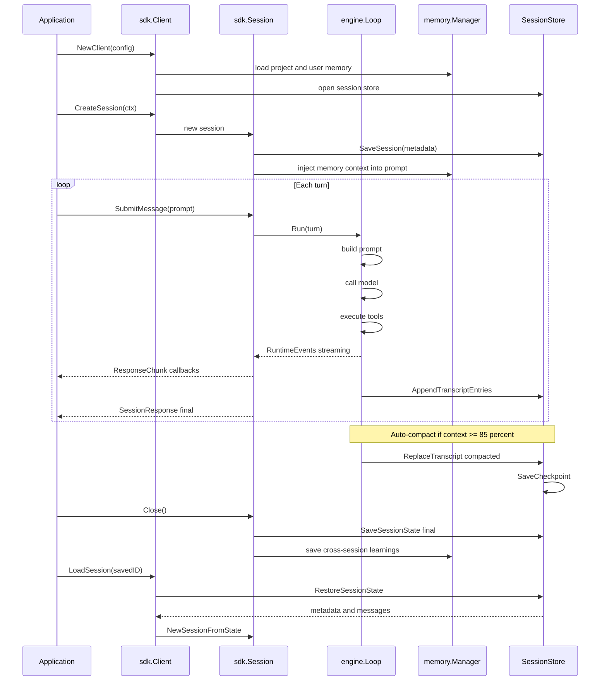
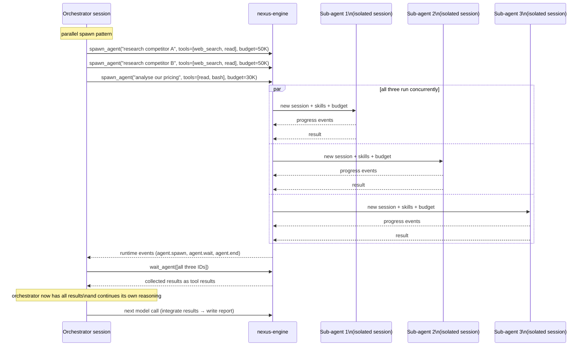
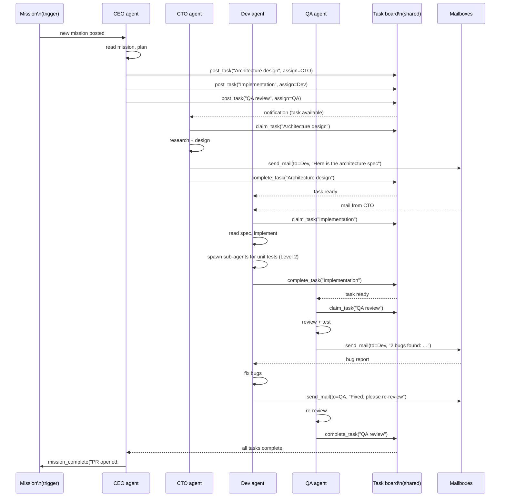

# Nexus — Architecture Diagrams

All diagrams are in Mermaid. Render with any Mermaid-compatible tool (GitHub, mermaid.live, VS Code extension, etc.).

---

## 6. Session and memory lifecycle

From session creation to cross-session memory persistence.

---

## 8. Sub-agent execution — Level 2

One-shot and parallel delegation patterns.

---

## 9. Team runtime — Level 3

How agents coordinate via mailbox and task board.

